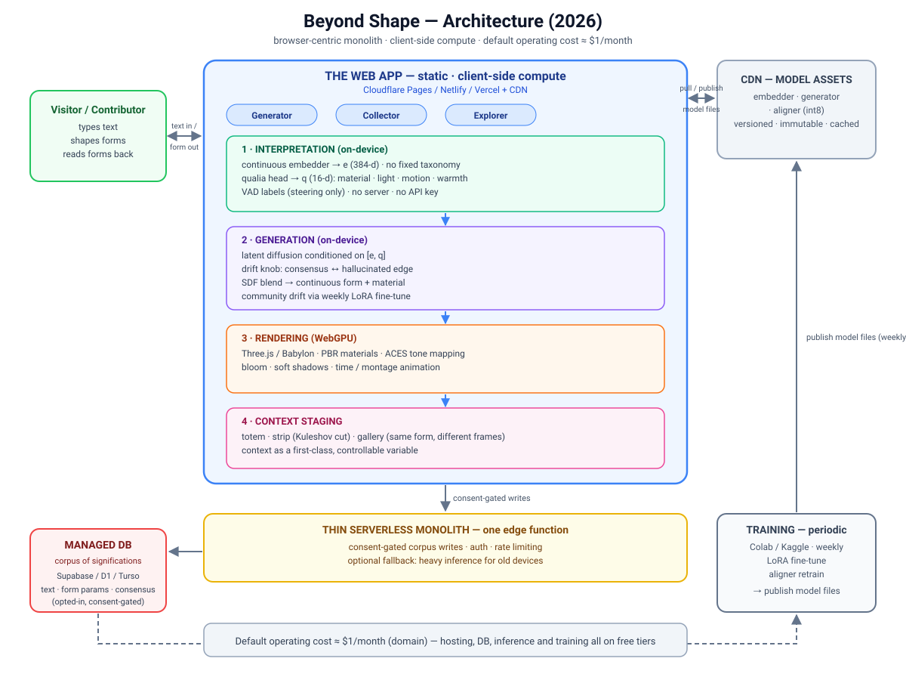

# Beyond Shape — Technical Design (2026)

> **Status:** Deep-dive companion to [`REDESIGN.md`](./REDESIGN.md) — fleshes out
> §3 (Technical Rebuild) and adds architecture + data-acquisition layers that
> the concept doc deliberately leaves unspecified.
>
> **Guiding constraints (stated):**
> 1. **Web is the output format.**
> 2. **No budget** → the system must be near-free to run.
> 3. **Not fond of microservices** → consolidate.
> 4. **Data acquisition needs rethinking** (MTurk originally).

---

## 1. Architecture: from six microservices to a browser-centric monolith

### 1.1 The core move — *the browser is the server*

The 2018 system shipped six independently deployed services, each with a
server, talking to Firestore + GCS, with model inference on a Node server.
With web output and zero budget, the decisive move is to **push compute to the
client**. Rendering, interpretation, and (most) generation can all run in the
visitor's browser — the visitor's own GPU, for free. What remains thin: the
static host, a small edge function, a managed database, and a periodic offline
training job on free GPU cycles.

### 1.2 The resulting deployment model — 3 deployables instead of 6

```
┌────────────────────────────────────────────────────────────────────┐
│  1. STATIC WEB APP  (Cloudflare Pages / Netlify / GitHub Pages)    │
│     "the experience" — all modes of the system in one app:         │
│       · Collector mode (shape a form for a text)                   │
│       · Generator mode (type text → see totem)                     │
│       · Explorer mode (read a form's readings)                     │
│     Client-side:                                                   │
│       · Interpretation (on-device embeddings / small LLM)          │
│       · Generation (on-device diffusion / SDF blending)            │
│       · Rendering (WebGPU + Three.js)                              │
│     Model assets shipped via CDN (quantized, versioned).           │
└───────────────┬────────────────────────────────────────────────────┘
                │  thin edge calls
                ▼
┌────────────────────────────────────────────────────────────────────┐
│  2. ONE SERVERLESS "MONOLITH"  (Cloudflare Workers / Netlify /     │
│     Vercel functions)                                              │
│     · Corpus read/write (with auth + rate limiting)                │
│     · Consent/logging                                             │
│     · Optional fallback: heavy inference only when on-device       │
│       is impossible (e.g., very old devices)                       │
└───────────────┬────────────────────────────────────────────────────┘
                ▼
┌────────────────────────────────────────────────────────────────────┐
│  3. MANAGED DATA + PERIODIC TRAINING                               │
│     · Database: Supabase (Postgres free tier) / Cloudflare D1 /    │
│       Turso — stores the *corpus of significations*                │
│     · Training: Colab / Kaggle free GPUs, weekly cadence           │
│       → exports small quantized models → pushed to CDN (static)    │
└────────────────────────────────────────────────────────────────────┘
```

### 1.2.1 Architecture diagram



*The same picture as an editable Mermaid diagram (renders natively on GitHub):*

```mermaid
flowchart TB
    V[Visitor / Contributor] <-->|"text in · form out"| APP

    subgraph APP["THE WEB APP — static, client-side compute (Pages / Netlify / Vercel)"]
        direction TB
        M[Generator · Collector · Explorer]
        I1["1 · Interpretation (on-device) — embedder → e(384) · qualia → q(16) · VAD labels"]
        G1["2 · Generation (on-device) — latent diffusion [e,q] · drift knob · SDF blend"]
        R1["3 · Rendering (WebGPU) — Three.js · PBR · ACES"]
        C1["4 · Context staging — totem · strip · gallery"]
        M --> I1 --> G1 --> R1 --> C1
    end

    APP <-->|pull / publish model files| CDN[CDN — model assets, int8, versioned]
    APP -->|consent-gated writes| EDGE[Thin serverless monolith — auth · rate limit · fallback]
    EDGE --> DB[(Managed DB — corpus: Supabase / D1 / Turso)]
    DB -.->|corpus pull (weekly)| TR[Training — Colab / Kaggle · LoRA · aligner]
    TR -->|publish model files (weekly)| CDN
```

There is **no dedicated decoder service, no interpreter service, no mapper
server, no constructor server**. Mapper, constructor, and consumer all become
*two screens of the same app*. The single edge function is the only "server
logic." This is a **serverless monolith**: one deployable, one codebase, one
schema — versus 2018's six repos, each needing its own orbs of secrets and a
pipeline.

> **Deployment & hosting are specified in detail in
> [Appendix A](#appendix-a-deployment-strategies--hosting-options).**

### 1.3 Why this beats the 2018 shape (and what we give up)

| Axis | 2018 (microservices) | 2026 (browser monolith) |
|---|---|---|
| Running cost | 4+ hosted services, GPU inference per call | ~$0/month (static + edge + DB free tiers) |
| Deploy units | 6 repos, 6 pipelines, env-per-service | 1 app + 1 edge fn + 1 DB schema |
| Inference | server-side per request | **on-device**, free, parallel, private |
| Latency | network hops per stage | local |
| Offline | not possible | the app works offline after load |
| Model changes | re-deploy service | ship a new model file to CDN; no downtime |
| API keys | in server env | **none needed client-side** (models are assets) |
| What we lose | central control, uniform hardware | guarantees about the user's device; model size ~ load time |

The honest trade-off of client-side inference is **device variance** and
**model size**. Both are manageable (§2, §5.5): quantize hard, fall back to a
WebGL path, and progressively enhance.

### 1.4 If we *must* keep a server

The only legitimate server-side compute today would be *training* and *optional
high-fidelity* generation (a big text-to-3D diffusion). Both are periodic or
opt-in, so they fit a "pay-per-job" model (Modal, Replicate, HuggingFace
Inference Endpoints) that costs a few dollars — or nothing on Colab/T4 free
tiers. This is the escape hatch that keeps the default at zero.

---

## 2. Client-side model runtime

- **ONNX Runtime Web → WebGPU** as the workhorse (models exported once from
  PyTorch, run in-browser; tensorrt-style int8/sym quant available).
- **Transformers.js** for text models when we want the HuggingFace
  convenience layer.
- **Model packaging:** quantized (int8/float16), versioned filenames, shipped
  from the same CDN as the app. First-load warmup with a progress surface;
  models load lazily per mode.
- **Privacy doubling:** not only do we not spend on inference — we don't even
  *see* the visitors' text if they stay fully client-side. That matters for the
  consent story (§6).

---

## 3. Interpretation layer — replacing the Watson 9-box

**Why the 9-box dies:** it was a fixed, vendor-imported cage (§ critique). The
concept now wants a *living distribution* of readings and a *continuous* space
in which the sign can be an occasion. The redesign keeps "interpretation," but
as an open, learned metric space instead of a catalog.

### 3.1 Primary representation — continuous text embeddings (on-device)

- Map text → a vector in a learned semantic manifold.
- Candidates (small, on-device, no server): `all-MiniLM-L6-v2` (384-d),
  `bge-small` (384-d), `gte-small`, `e5-small` (~33–95 M params, int8 →
  ~25–90 MB). All run fine in-browser.
- The vector is the new "emotion vector": not nine named slots but a point in
  a continuous space of *meaning*. The concept's "the vector as the interval"
  holds — the interval is just far richer now.

### 3.2 The aligner — our own sign-space (the heart of the rebuild)

The 2018 architecture bridged text and form with an arbitrary encoder + a tiny
MLP. The modern and *concept-true* version: **learn a shared metric space
between language and form from our own collected corpus.**

- **Collect:** pairs of (text, resulting form-parameters/render).
- **Train:** a small contrastive model that pulls a text embedding and a form
  embedding together when the community made them correspond. Two cheap
  options:
  1. **Distill from CLIP:** use CLIP/SigLIP embeddings as soft teacher labels
     to train a tiny student aligner (text ↔ rendered-form) that runs on-device
     — avoids shipping a multi-hundred-MB CLIP.
  2. **Pure corpus alignment:** a small MLP/attention aligner trained directly
     on community pairs, using a pretrained text embedder for language and a
     per-device render-embedding encoder for forms.
- **What this *is* conceptually:** the **convention-crystallizer**, rebuilt as a
  learned geometry. The "arbitrary bridge" between signifier and signified is
  replaced by a metric that the community's data actually produces. This is the
  strongest single upgrade in the whole design — it makes the concept
  *operationally true* instead of ornamental.

### 3.3 Sensory qualia channel (aesthetic, not semantic)

Beauty was limited because the representation was *semantic* (anger score),
not *sensory*. Add a **qualia vector** — low-cost, two implementation paths:

1. **On-device small LLM** (e.g., quantized SmolLM-135M / Qwen2.5-0.5B) that
   extracts sensory descriptors: *material, temperature, light, motion,
   time-of-day, texture, weight, sound* → a small structured vector.
2. **Trained probes (cheaper perf):** linear heads on the text embedding that
   predict the same qualia dimensions (trained on a small labeled seed set).
   Near-free at inference, very small.

Either path feeds the generator a *sensory* conditioning channel that the 9-box
could never express.

### 3.4 Dimensional overlay — where "emotion" survives

- Keep a **valence–arousal–dominance** (VAD) readout (a small probe or a
  prompt) as an **optional human-facing layer**: it re-labels what the model is
  doing, gives the UI a legible anchor, and powers the mapper's feedback.
- Crucial: VAD is for *interface and steering*, not for *conditioning*. The
  actual conditioning is the rich embedding + qualia. "Emotion" becomes an
  ergonomic, contestable label — not the cage.

### 3.5 Output of the interpretation layer

```
text ──▶ on-device embedder ──▶ e ∈ R^384
       ──▶ qualia head ──────▶ q ∈ R^~16  (material/light/motion/…)
       ──▶ optional VAD ─────▶ v ∈ R^2/3  (labels/steering only)
       ──▶ conditioning latent c = [e, q]  (+ optional v)   ~400-dim
```

No fixed taxonomy, no vendor API, no server call, ~free.

---

## 4. Generation layer — from argmax to sampled continuous form

### 4.1 The problem with 10 primitives

Argmaxing one-hot shape slots forces every sign through ten presets — the
"mean of box and cone" is unreachable, and the representation encoded the
machine's *cage*. The concept demands **continuous form** where the consensus
center and the hallucinated edges are all *renderable*.

### 4.2 Core recommendation — SDF latent space

- Maintain a small **library of parametric procedural SDFs** (signed distance
  functions): box, sphere, cylinder, torus, capsule, twisted/rounded variants,
  noise-displaced blobs.
- The generator emits **blending weights + per-part parameters**
  (smooth-min blends between SDFs, plus scale, twist, displacement amplitude).
- Rendering: raymarch the blended SDF in a WebGPU fragment shader (cheap,
  high quality, no mesh baking needed for display), or extract a low-poly mesh
  once for interactions.
- **What this gives us:** a *continuous* shape space — "between box and sphere"
  is now a reachable, beautiful, renderable thing; primitives are the vertices
  of the space, not the whole space. The mean/mode critique is dissolved at the
  representation level. Material params (color, roughness, metalness, emissive,
  opacity) ride along the same latent.

### 4.3 Conditioning + sampling — the drift knob made real

- A **small latent diffusion** (or DiT / MLP-diffusion over a ~64-dim latent)
  conditioned on `c = [e, q]` from §3. On-device: this is a lightweight model
  (tens of MB at int8).
- **Sampling parameters = the expressive instrument:**
  - *low temperature / low top-p →* the **consensus** — the most legible,
    most understood form (the sign as the community's center).
  - *high temperature →* the **hallucinated edge** — plausible-but-never-seen
    forms (the sign reaching its own perimeter).
  - The artist/user tunes this per input: a slider called something honest —
    **"how convention-bound should this be?"**
- Cacheable with a fixed seed for reproducibility; multiple samples = a small
  *distribution of forms*, displayed as alternates (this is how the "living
  distribution" becomes visible UI instead of a concept).

### 4.4 Community drift — the convention keeps moving, at a cadence

- Collected mappings accumulate in the DB.
- A **periodic job (weekly)** fine-tunes the small generator (LoRA) — or
  retrains the aligner — on the new corpus using free GPU (Colab/T4). The
  updated model file is pushed to CDN; the app picks it up as a new asset
  version.
- This honors "the sign drifts with its community" *honestly*: not real-time,
  not glamorous, but real. The **drift is a weekly release note** — a visible,
  checkable event ("this week, *sadness* shifted toward x").

### 4.5 What survives from the 22-dim vector

Keep a thin, *human-facing* **affordance vector** (a handful of continuous
readouts: hue, lightness, scale, rotation…) *derived from* the generated form —
not as the model's output space, but as the **inspector/UI layer** and a
fallback for accessibility. Inspectability returns as a view over the latent,
not a shackle on it.

---

## 5. Rendering & experience — WebGPU, real-time, deliberate

### 5.1 Stack

- **WebGPU** renderer via **Three.js** (mature, WebGPU backend) or **Babylon.js**
  (excellent WebGPU + node materials) depending on taste. Keep a **WebGL2**
  fallback for older devices.
- **Look:** PBR materials (physical now — roughness/metalness/clearcoat),
  **ACES tone mapping**, sRGB, **UnrealBloom**, soft shadows (PCSS),
  environment lighting, optional DOF.
- The 2018 "one ambient light + one hardcoded point light" becomes a designed
  **lighting grammar** — light is part of the sign, not a default.

### 5.2 Time as montage-in-time

- The generation output includes a **motion curve**: shapes that grow, breathe,
  shed, reassemble. Animation is not ornament; it is the Kuleshov cut rendered
  in time (§4 of REDESIGN).
- Sequence editor primitives: ordering, timing, juxtaposition — the artist can
  stage context, not just render a static totem.

### 5.3 Context staging surfaces

Three viewer modes map directly to the concept:
1. **The totem** (one text → one sculpture; shapes re-read their neighbours).
2. **The strip** (multiple forms sequenced — Kuleshov as an explicit control).
3. **The gallery** (the same form under deliberately different contextual
   frames: with/without source text, warm/cold palette, different lighting,
   different scale) — *context as first-class variable*, implemented as
   render presets, not as prose.

### 5.4 Progressive enhancement

- Load order: app → renderer → text model → generator. First paint shows a
  low-poly/raymarched placeholder; refinement happens as models warm.
- Low-end path: WebGL2 + a *tiny* generator variant + pre-baked SDF palette.

### 5.5 Device & size honesty

- Budget: total client *model* payload ≤ ~120 MB int8 across interpretation +
  generator (text embedder ~30–90 MB; small diffusion ~30–60 MB; aligner few
  MB). Loaded lazily per mode. Acceptable on web with CDN caching; the
  alternative (server GPU) is what we're avoiding for budget reasons.

---

## 6. Data acquisition — from MTurk to a living artwork

### 6.1 Why MTurk is conceptually wrong, not just expensive

Mturk pays people to *work*. Contributions produced as labor are (a) costly,
(b) quality-variable, and (c) conceptually off-key — the concept wants
sign-making as *play, identity, and shared authorship*. The new strategy makes
**contributing *be* the artwork.**

### 6.2 The co-creation loop (primary strategy)

The collector is not a "research form"; it is the **same experience as the
generator**:

1. Visitor types a sentence.
2. The visitor *shapes* a form for it (SDF editor: grab, rub, twist, tint).
3. The machine shows its reading back — in the same space: "I read this as
   *your* form being close to / far from the community consensus," with the
   current distribution of forms visible.
4. The visitor may accept, adjust, or reject — each move is a labeled gradient
   sample, not just a final answer.

This stages the **human ↔ machine reading contest** as the interface itself —
which is the concept made visible — *and* yields rich data (pairs, near-misses,
rejections — the *variance* the concept celebrates, not averaged away).

### 6.3 Viral / shareable mechanics (secondary engine)

- One-shot contribution → a **shareable card** (the form, the text, the
  disagreement with the machine) — embeddable, postable. Social spread is
  acquisition without a budget.
- Generated forms are inherently visual; the strip/gallery modes (§5.3) are
  built to be exported as images/video.

### 6.4 Community / garden model

- Contributions **visibly drift** the living sign (weekly release notes, §4.4).
- A public **"state of the consensus"** page: per-text, the distribution of
  forms, the center, the edges. People see their mark in collective meaning.
- This gives contributors authorship, not a payoff.

### 6.5 Institutional & onsite pipelines

- **Classes/workshops:** a packable "session mode" (one prompt, a class shapes
  together, results drift the seed corpus — pedagogically rich, structured).
- **Installations/galleries:** a kiosk running the loop in an exhibition;
  visitors contribute without framing it as labor — the loop *is* the piece.

### 6.6 Social/event bots (optional, consent-gated)

- A bot that posts prompts and publishes commissioned forms; replies become
  corpus entries **only with explicit opt-in**, with clear licensing.

### 6.7 Cold-start bootstrap

- Before any humans arrive, **pre-seed** the corpus with the machine's *own*
  readings (generated forms for seed texts); humans then **correct and drift**
  it. This removes the empty-estate problem and makes the first visitors'
  contributions *relative* to an existing consensus (a better first experience).

### 6.8 Quality & validation without paid labor

- **Convergence checks:** a text's mapping is trustworthy when the community's
  distribution tightens; flag/soft-weight divergent outliers rather than
  clamping them (we *want* the edges, but we need to know they are edges).
- **Honeypots:** occasional nonsensical prompts; contributions with near-zero
  dwell time are discarded or down-weighted.
- **Consent & licensing:** single explicit opt-in, plain language; the corpus —
  as a collective artwork — is released under an open license (CC), with
  anonymized authorship. Because inference is client-side, the platform doesn't
  even *hold* visitor text involuntarily: the edge fn only stores opted-in,
  consent-gated records.

### 6.9 The tally against MTurk

| | MTurk (2018) | Living artwork (2026) |
|---|---|---|
| Cost | paid per HIT | ~$0 (contribution is play/authorship) |
| Motivation | wage | curiosity, sharing, visible authorship |
| Data quality | variable, work-flavored | gradient samples incl. rejections; consent-rich |
| Ethical framing | labor pool | co-authors of a generative collective sign |
| Concept fit | off | *is* the concept |

---

## 7. Cost model (the honest bottom line)

| Item | Monthly |
|---|---|
| Static hosting (Pages/Netlify/CF) | $0 |
| Edge function | $0 (free tiers) |
| Database (Supabase/D1/Turso free tier) | $0 |
| On-device inference | $0 (visitor GPU) |
| Text models | $0 (open weights, shipped as assets) |
| Training (Colab/Kaggle free) | $0 |
| Domain | ~$1 |
| **Total to operate** | **≈ $1/month** |
| Optional spend (opt-in only): paid LLM qualia layer, high-fidelity server inference, MTurk-free workshops with stipends | variable, by choice |

The architecture is designed so the default path never requires spending money,
and spending money only ever *improves* quality (never unlocks core function).

---

## 8. Open design questions (for the next deep-dive passes)

1. **Generator form:** SDF-blended latent (recommended) vs. a 3D-native small
   diffusion vs. a hybrid. Needs a small on-device benchmark of model size/µs.
2. **Aligner teacher:** distill-from-CLIP vs. corpus-only alignment. Needs a
   small dataset experiment to validate that corpus-only signals suffice.
3. **WebGPU vs WebGL2 split:** targeting and fallback policy (esp. Safari
   WebGPU status in 2026).
4. **Corpus ownership & tooling:** schema, anonymization, the CC license
   wording, and the weekly drift pipeline tooling.
5. **VAD layer:** keep as a label? train a small probe? or drop and let
   embeddings speak for themselves?
6. **Session/export formats:** the strip/gallery as share units — PNG/WebM,
   and whether to allow embedding like an `<iframe>`.

---

## 9. Cross-references & roadmap

- Concept: [`CONCEPT.md`](./CONCEPT.md) (reframe: sign as living distribution,
  occasion-not-message, context as first-class).
- Vision: [`REDESIGN.md`](./REDESIGN.md) (skeleton; this document fleshes out
  its §3 + adds architecture/data chapters).
- Current system: [`BEYOND-SHAPE-SPEC.md`](./BEYOND-SHAPE-SPEC.md).

**Next passes (in order):**
1. §8.1 / §8.2 — small on-device benchmark of embedder + generator + SDF
2. §8.4 — corpus schema + consent + drift-pipeline spec
3. A **minimal vertical slice** (text → embed → cold-start form → render)
   before any full rebuild.

---

## Appendix A: Deployment Strategies & Hosting Options

This appendix makes the deployment story explicit: how changes ship, which
hosting options exist at what cost, and the exact shape we recommend.

### A.1 Deployment strategy — how changes ship

- **One repo, one app, trunk-based.** The whole system (app + edge function +
  DB migrations + model pipeline) lives in a single repository. No
  multi-repo orchestration, no per-service pipelines.
- **CI/CD via GitHub Actions** (free for public repos):
  1. *on push to main* → lint → test (vitest/playwright smoke) → build →
     deploy static app to Pages/Netlify/CF → deploy edge function.
  2. *on pull request* → preview deployment (Netlify/CF/Vercel all provide
     per-PR URLs) + test suite. Preview shows the PR's live UI with the prod
     data read-only.
- **Environments:** `production` + per-PR `preview`, plus an optional `staging`
  (same as prod, pointed at a `results_staging` collection). No more than three.
- **Database migrations:** plain SQL files, applied in CI in order; the corpus
  schema is versioned (`schema_migrations` table). Supabase migrations via the
  `supabase` CLI.
- **Model release pipeline** (separate workflow, run weekly + on demand):
  1. Train on free GPU (Colab/Kaggle) or trigger the script from CI.
  2. Export quantized int8 ONNX models + write a `models.json` *manifest*
     (`{ "interpretation": {"version": "v12", "url": "…"}, "generation": … }`).
  3. Commit the manifest; push model files to the CDN (immutable,
     content-hashed names → long-lived cache).
  4. The app revalidates the manifest on boot; **rollback = point the manifest
     at the previous version** (instant, no re-deploy).
- **Rollback everything else:** static host deploy-history rollback
  (Netlify/CF/Vercel all keep previous deploys); edge function rollback = redeploy
  previous commit; corpus is *append-only* so data is never lost.

### A.2 Hosting options — comparison

**Static app + edge functions:**

| Option | Free tier (approx.) | Static app | Edge fn | Verdict |
|---|---|---|---|---|
| **Cloudflare Pages + Workers** | unlimited bandwidth, 500 builds/mo, 100k edge req/day | ✓ | ✓ | **Recommended default** — best free limits, global CDN, R2 egress-free |
| Netlify | 100 GB bandwidth, 300 build-min/mo, 125k fn req/mo | ✓ | ✓ | Great DX + per-PR previews; fine alternative |
| Vercel | 100 GB bandwidth, 100k serverless invocations/mo | ✓ | ✓ | Best if we choose Next.js; same model |
| GitHub Pages | free, static only | ✓ | ✗ | Needs a separate edge host; only for the pure-static case |
| S3 + CloudFront | pay (≈$1–3/mo) | ✓ | ✗ (Lambda extra) | More control, but no longer free |

**Database:**

| Option | Free tier (approx.) | Notes |
|---|---|---|
| **Supabase** (Postgres) | 500 MB DB, 50k MAU auth, 1 GB storage | **Recommended** — relational corpus + built-in auth + RLS + realtime + REST |
| Cloudflare D1 (SQLite) | 5 GB, 5M rows read/day | Strong if we go all-in on Cloudflare; simpler, less featureful |
| Turso (libSQL) | 9 GB, 1B rows read/mo | Edge SQLite; good for read-heavy consensus queries |
| Neon (Postgres) | 0.5 GB free tier | Serverless Postgres alternative |
| Firebase Firestore | free tier exists | What 2018 used; works, but Postgres is better for this schema |

**Training (no budget):**

| Option | Free tier | Notes |
|---|---|---|
| **Google Colab** | T4 GPU, ~12 h sessions | Free; needs scheduled/resumable notebooks |
| **Kaggle** | P100/T4, 30 h/week | Free; scheduled notebooks possible |
| GitHub Actions | no free GPU | skip |
| Modal / Replicate / HF Endpoints | pay-per-job/inference | opt-in escape hatch for big fine-tunes or server inference |

### A.3 The three deployment shapes

- **Shape A — default (≈ $1/month):** Cloudflare Pages + one Worker +
  Supabase free tier + on-device models + Colab training.
- **Shape B — moderate (still $0–1):** Shape A + a `staging` environment +
  Supabase Auth/RLS hardening + Sentry free tier.
- **Shape C — paid upgrades (opt-in only, by choice):** server-side
  high-fidelity generation (Modal), a paid LLM qualia layer, and paid GPU for
  larger fine-tunes. Nothing in Shape C unlocks core function; it only improves
  fidelity.

### A.4 Key operational details

- **Domains & TLS:** automatic and free on CF/Netlify/Vercel.
- **Caching:** model assets = immutable, content-hashed → cache-forever.
  `models.json` manifest = short TTL / revalidated. App shell = standard.
- **Offline:** the app can be a PWA (service worker + cached models), which is
  valuable for gallery/installation kiosks on-site.
- **Observability:** edge function logs + free analytics (CF/Netlify/Vercel);
  optional Sentry free tier. No APM needed at this scale.
- **Consent & data:** client-side inference means we never process text
  server-side unless the visitor opts in. The DB stores only opted-in records.
  The corpus is published as a CC-licensed collective work.
- **Secrets:** the only secret is the edge function's DB connection string (in
  the platform's environment store). No API keys ship to the browser.

### A.5 What we deliberately do *not* run

- No always-on Node/V8 servers, no Kubernetes, no Docker hosts (except
  ephemeral training), no GPU serving, no message queues, no separate logging
  stack. Every one of those is a 2018-ism that costs money to keep warm and
  nothing to drop.